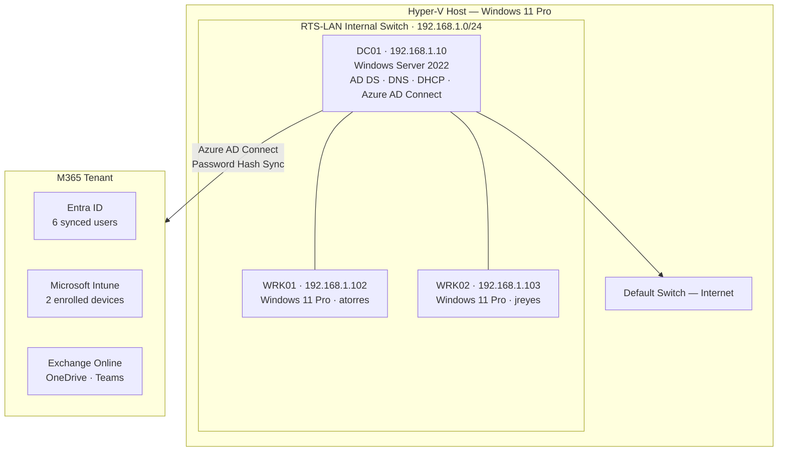

# Ridgeline Technology Services — IT Support Lab

A hands-on IT environment simulating the infrastructure of a 20-person company — built and operated end-to-end across Active Directory, Microsoft Intune, Entra ID, PowerShell automation, and a fully configured help desk.

*B.S. Computer Science · Cybersecurity & Defense Certificate — University of Colorado Denver*

---

## Skills Demonstrated

| Skill | Proof |
|---|---|
| Active Directory — user accounts, OU structure (Organizational Units — the folder system that organizes employees by department), and security groups | [New-RTSUser.ps1](scripts/New-RTSUser.ps1) · [Invoke-RTSOnboarding.ps1](scripts/Invoke-RTSOnboarding.ps1) · [TICKET-005](tickets/TICKET-005.md) |
| Group Policy — password enforcement, workstation hardening, and account lockout policy (Group Policy automatically applies security and configuration settings to every computer in the company) | [asset-register.md](docs/asset-register.md) · [TICKET-004](tickets/TICKET-004.md) |
| Microsoft Intune — MDM enrollment, compliance, and configuration profiles (MDM — Mobile Device Management — lets IT remotely manage and secure company computers) | [SOP: device-enrollment](docs/sops/device-enrollment.md) · [TICKET-003](tickets/TICKET-003.md) |
| Software deployment via Intune — Win32 app packaging and push to all enrolled devices (deploying software to every company computer automatically, without visiting each desk) | [SOP: software-deployment](docs/sops/software-deployment.md) · [TICKET-006](tickets/TICKET-006.md) |
| Azure AD / Entra ID — Connect sync and cloud identity (Entra ID syncs on-premises employee accounts to Microsoft 365 so the same login works for Teams, OneDrive, and email) | [TICKET-002](tickets/TICKET-002.md) · [Get-RTSComplianceReport.ps1](scripts/Get-RTSComplianceReport.ps1) |
| PowerShell automation — user provisioning, compliance reporting, and password management (scripts that automate repetitive IT tasks so technicians can focus on real problems) | [New-RTSUser.ps1](scripts/New-RTSUser.ps1) · [Reset-RTSUserPassword.ps1](scripts/Reset-RTSUserPassword.ps1) · [Get-RTSComplianceReport.ps1](scripts/Get-RTSComplianceReport.ps1) |
| DNS, DHCP, and SMB file shares — with least-privilege access control (DNS gives computers names; DHCP assigns network addresses; SMB file shares are the company file server, with access controlled per security group) | [asset-register.md](docs/asset-register.md) · [TICKET-008](tickets/TICKET-008.md) |
| End-user troubleshooting — systematic triage, investigation, and resolution documented for every incident (diagnosing and fixing the problems employees report, step by step) | [8 resolved tickets](tickets/) · [5 KB articles](docs/kb/) |
| Audit logging — password reset events written to a timestamped log on the domain controller (audit logs prove who changed what and when — required for security and compliance accountability) | [Reset-RTSUserPassword.ps1](scripts/Reset-RTSUserPassword.ps1) |
| Technical documentation — SOPs (step-by-step procedures), KB articles (solutions library), and an asset register (equipment inventory) | [SOP: new-user-onboarding](docs/sops/new-user-onboarding.md) · [asset-register.md](docs/asset-register.md) · [KB-001](docs/kb/KB-001-account-lockout.md) |
| Hyper-V virtualization — provisioned three virtual machines to simulate a real office network from scratch | [New-RTSLabVMs.ps1](scripts/setup/New-RTSLabVMs.ps1) |

---

*Active Directory — employee accounts organized into department folders (Operations, Finance, IT), mirroring how enterprise companies structure user management*

*Microsoft Intune — both company workstations enrolled, managed, and reporting compliance status remotely*

*osTicket help desk (an IT ticketing platform used by organizations of all sizes to track support requests) — 8 support incidents worked end-to-end, each documented with triage, investigation, resolution, and lessons learned*

---

Ridgeline Technology Services is a simulated IT environment modeled after a 20-person company. Every component — user accounts, device management, cloud identity, file shares, and the help desk — was built and configured from scratch to mirror what a technician manages at a small or mid-size company.

The lab runs a Windows Server 2022 domain controller, two Windows 11 workstations, and a Microsoft 365 tenant. On-premises Active Directory syncs to Entra ID (Microsoft's cloud identity platform) so the same employee credentials work across the office network and cloud services like Teams and OneDrive. All eight support tickets were worked end-to-end and documented to the standard of a professional IT team.

---

## Lab Architecture

The diagram below shows how the on-premises lab (left) connects to Microsoft 365 cloud services (right). DC01 is the main server — it manages user logins, assigns network addresses to devices, and keeps on-premises and cloud accounts synchronized.

| Asset | Hostname | OS | IP | Role |
|---|---|---|---|---|
| DC01 | WIN-DTBFF0R4BBQ | Windows Server 2022 | 192.168.1.10 | AD DS, DNS, DHCP, Azure AD Connect |
| WRK01 | DESKTOP-4PL0V3F | Windows 11 Pro | 192.168.1.102 | Domain workstation — atorres |
| WRK02 | DESKTOP-BTK0BJ4 | Windows 11 Pro | 192.168.1.103 | Domain workstation — jreyes |

*Entra ID — all 6 RTS users synced from on-premises Active Directory to Microsoft 365 via Azure AD Connect*

All VMs run on Hyper-V with an internal switch (`RTS-LAN 192.168.1.0/24`). DC01 has a second network adapter on the Default Switch for internet access. The domain `ridgeline.local` syncs to a Microsoft 365 tenant via Azure AD Connect using Password Hash Sync (a method that keeps passwords synchronized between the office network and the cloud without storing them in plaintext).
