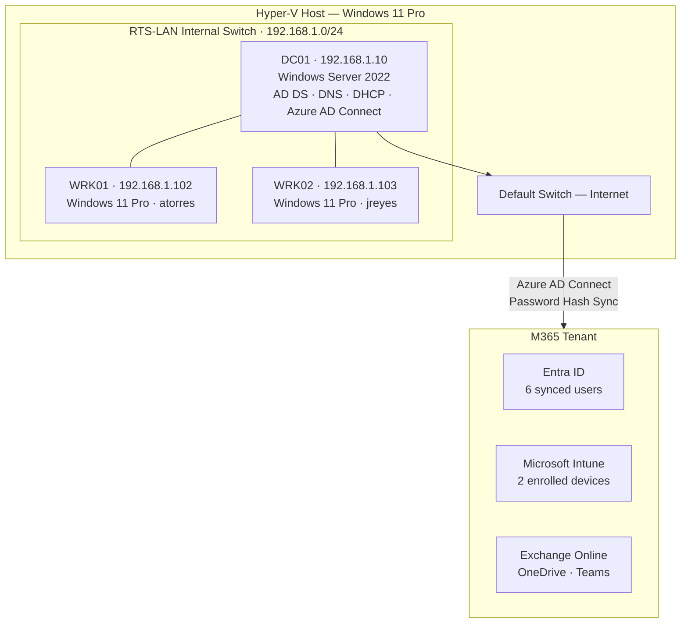

# Ridgeline Technology Services — IT Support Lab

**Technician:** Richard Blea &nbsp;|&nbsp; **Status:** Complete &nbsp;|&nbsp; **Built:** April 2026

A hands-on home lab simulating the on-premises and cloud infrastructure of a 20-person company. Demonstrates the core skills required for a Systems Administrator or IT Support role: Active Directory, Microsoft Intune MDM, Entra ID, PowerShell automation, and end-user support.

---

## What This Demonstrates

| Skill | Proof |
|---|---|
| Active Directory — OU design, user/group management | [New-RTSUser.ps1](scripts/New-RTSUser.ps1) · [Invoke-RTSOnboarding.ps1](scripts/Invoke-RTSOnboarding.ps1) · [TICKET-005](tickets/TICKET-005.md) |
| Group Policy — password policy, workstation hardening | [asset-register.md](docs/asset-register.md) · [TICKET-004](tickets/TICKET-004.md) |
| Microsoft Intune — MDM enrollment, compliance, config profiles | [SOP: device-enrollment](docs/sops/device-enrollment.md) · [TICKET-003](tickets/TICKET-003.md) |
| Win32 App Deployment via Intune | [SOP: software-deployment](docs/sops/software-deployment.md) · [TICKET-006](tickets/TICKET-006.md) |
| Azure AD / Entra ID — Connect sync, cloud identity | [TICKET-002](tickets/TICKET-002.md) · [Get-RTSComplianceReport.ps1](scripts/Get-RTSComplianceReport.ps1) |
| PowerShell Automation — AD module, Graph API, Hyper-V | [scripts/](scripts/) |
| DNS, DHCP, SMB file shares | [asset-register.md](docs/asset-register.md) · [TICKET-008](tickets/TICKET-008.md) |
| End-user troubleshooting — systematic diagnosis | [8 resolved tickets](tickets/) · [5 KB articles](docs/kb/) |
| Technical documentation — SOPs, KB, asset register | [docs/](docs/) |
| Hyper-V lab provisioning | [New-RTSLabVMs.ps1](scripts/setup/New-RTSLabVMs.ps1) |

---

## Security Relevance

This lab demonstrates security fundamentals that map directly to cybersecurity roles:

| Concept | Implementation |
|---|---|
| **Least Privilege** | Security groups (Operations Users, Finance Users, IT Staff) restrict SMB share access — [TICKET-008](tickets/TICKET-008.md) |
| **Audit Logging** | Password resets written to a timestamped audit log on DC01 — [Reset-RTSUserPassword.ps1](scripts/Reset-RTSUserPassword.ps1) |
| **Compliance Enforcement** | Intune compliance policy enforces OS version and encryption requirements across all enrolled devices — [TICKET-003](tickets/TICKET-003.md) |
| **Identity Lifecycle Management** | Users provisioned in AD, synced to Entra ID, licensed in M365 — [TICKET-005](tickets/TICKET-005.md) |
| **GPO Security Baseline** | Password complexity (10-char min), account lockout (5 attempts / 30-min window) via Group Policy — [TICKET-004](tickets/TICKET-004.md) |
| **OAuth2 / Graph API Auth** | Compliance report authenticates via OAuth2 device code flow to Microsoft Graph — [Get-RTSComplianceReport.ps1](scripts/Get-RTSComplianceReport.ps1) |
| **ACL Troubleshooting** | Diagnosed explicit Deny ACE overriding Allow permissions on Finance$ SMB share — [TICKET-008](tickets/TICKET-008.md) |

---

## Lab Architecture

| Asset | Hostname | OS | IP | Role |
|---|---|---|---|---|
| DC01 | WIN-DTBFF0R4BBQ | Windows Server 2022 | 192.168.1.10 | AD DS, DNS, DHCP, Azure AD Connect |
| WRK01 | DESKTOP-4PL0V3F | Windows 11 Pro | 192.168.1.102 | Domain workstation — atorres |
| WRK02 | DESKTOP-BTK0BJ4 | Windows 11 Pro | 192.168.1.103 | Domain workstation — jreyes |

All VMs run on Hyper-V with an internal switch (`RTS-LAN 192.168.1.0/24`). DC01 has a second NIC on the Default Switch for internet access. The domain `ridgeline.local` syncs to a Microsoft 365 tenant via Azure AD Connect (Password Hash Sync).

---

## What Was Built

1. **Active Directory** — domain `ridgeline.local`, 3 department OUs (Operations, Finance, IT), 6 users, 4 security groups
2. **DNS & DHCP** — DNS forwarder to 8.8.8.8, DHCP scope 192.168.1.100–200 on DC01
3. **Group Policy** — RTS-Password-Policy (10-char min, lockout after 5 attempts), RTS-Workstation-Policy (Cortana block, lock screen)
4. **Azure AD Connect** — Password Hash Sync, all 6 users synced to Entra ID
5. **Microsoft Intune** — both workstations enrolled, compliance policy (RTS-Workstation-Compliance), configuration profile (RTS-Workstation-Config)
6. **Win32 App Deployment** — 7-Zip 24.09 and Notepad++ 8.7.4 deployed to all devices via Intune
7. **PowerShell Automation** — user onboarding, bulk provisioning, compliance reporting, password reset with audit log, Hyper-V lab provisioning
8. **Support Scenarios** — 8 tickets worked end-to-end across account management, cloud identity, software deployment, and file share permissions

---

## Scripts

| Script | Description |
|---|---|
| [`scripts/New-RTSUser.ps1`](scripts/New-RTSUser.ps1) | Bulk AD user creation from CSV with Entra ID sync |
| [`scripts/Invoke-RTSOnboarding.ps1`](scripts/Invoke-RTSOnboarding.ps1) | End-to-end single user onboarding — AD account, groups, and sync |
| [`scripts/Reset-RTSUserPassword.ps1`](scripts/Reset-RTSUserPassword.ps1) | Reset AD password with timestamped audit log entry |
| [`scripts/Get-RTSComplianceReport.ps1`](scripts/Get-RTSComplianceReport.ps1) | Export Intune device compliance report via Microsoft Graph API (OAuth2) |
| [`scripts/setup/New-RTSLabVMs.ps1`](scripts/setup/New-RTSLabVMs.ps1) | Provision Hyper-V virtual switch and 3 VMs with Gen 2, Secure Boot, and virtual TPM |

---

## Documentation

### Standard Operating Procedures

| SOP | Description |
|---|---|
| [`docs/sops/new-user-onboarding.md`](docs/sops/new-user-onboarding.md) | End-to-end new employee setup — AD, Entra ID sync, M365 license |
| [`docs/sops/device-enrollment.md`](docs/sops/device-enrollment.md) | Intune MDM enrollment for domain-joined Windows 11 devices |
| [`docs/sops/software-deployment.md`](docs/sops/software-deployment.md) | Win32 app packaging and deployment via Intune |

### Knowledge Base

| Article | Topic |
|---|---|
| [`KB-001`](docs/kb/KB-001-account-lockout.md) | Unlocking locked AD accounts |
| [`KB-002`](docs/kb/KB-002-new-user-onboarding.md) | New employee setup reference |
| [`KB-003`](docs/kb/KB-003-software-request.md) | Software deployment via Intune |
| [`KB-004`](docs/kb/KB-004-onedrive-sync-error.md) | Resolving OneDrive invalid filename errors |
| [`KB-005`](docs/kb/KB-005-file-share-permissions.md) | Granting and revoking file share access |

### Support Tickets

| Ticket | Summary | Status |
|---|---|---|
| [TICKET-001](tickets/TICKET-001.md) | DC hostname not renamed post-promotion | Closed — accepted |
| [TICKET-002](tickets/TICKET-002.md) | Azure AD Cloud Sync blocked by network — switched to AD Connect | Closed — resolved |
| [TICKET-003](tickets/TICKET-003.md) | BitLocker non-compliance on lab VMs (no TPM) | Closed — accepted risk |
| [TICKET-004](tickets/TICKET-004.md) | Account lockout — atorres locked after 5 failed login attempts | Closed — resolved |
| [TICKET-005](tickets/TICKET-005.md) | New employee onboarding — Jamie Chen, Finance | Closed — resolved |
| [TICKET-006](tickets/TICKET-006.md) | Software request — Notepad++ deployment via Intune | Closed — resolved |
| [TICKET-007](tickets/TICKET-007.md) | OneDrive sync error — invalid filename characters | Closed — resolved |
| [TICKET-008](tickets/TICKET-008.md) | File share access denied — Finance$ SMB share | Closed — resolved |

---

## Screenshots

Deployment proof in [`screenshots/`](screenshots/):

| File | Shows |
|---|---|
| `01-aduc-ous.png` | AD Users and Computers — RTS OU structure and users |
| `02-azure-ad-users.png` | Entra ID — synced RTS users in M365 admin center |
| `03-intune-devices.png` | Intune — both workstations enrolled and managed |
| `04-compliance-policy.png` | Intune — RTS-Workstation-Compliance policy |
| `04b-compliance-status.png` | Intune — compliance monitor showing noncompliant: 2 |
| `05-7zip-deployed.png` | Intune — 7-Zip installed on both devices |
| `06-gpo-console.png` | GPMC — RTS-Password-Policy and RTS-Workstation-Policy |
| `07-dhcp-scope.png` | DHCP — Scope 192.168.1.0 RTS-LAN |
| `08-password-reset-log.png` | DC01 — password reset audit log entry |
