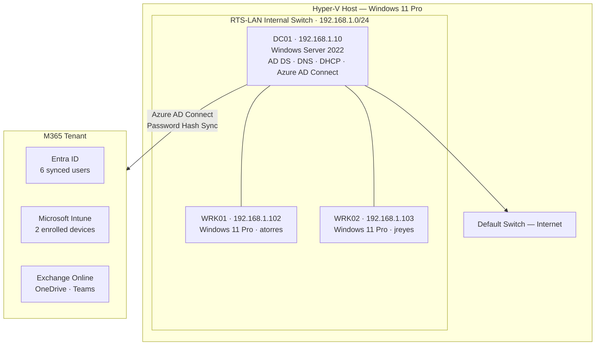
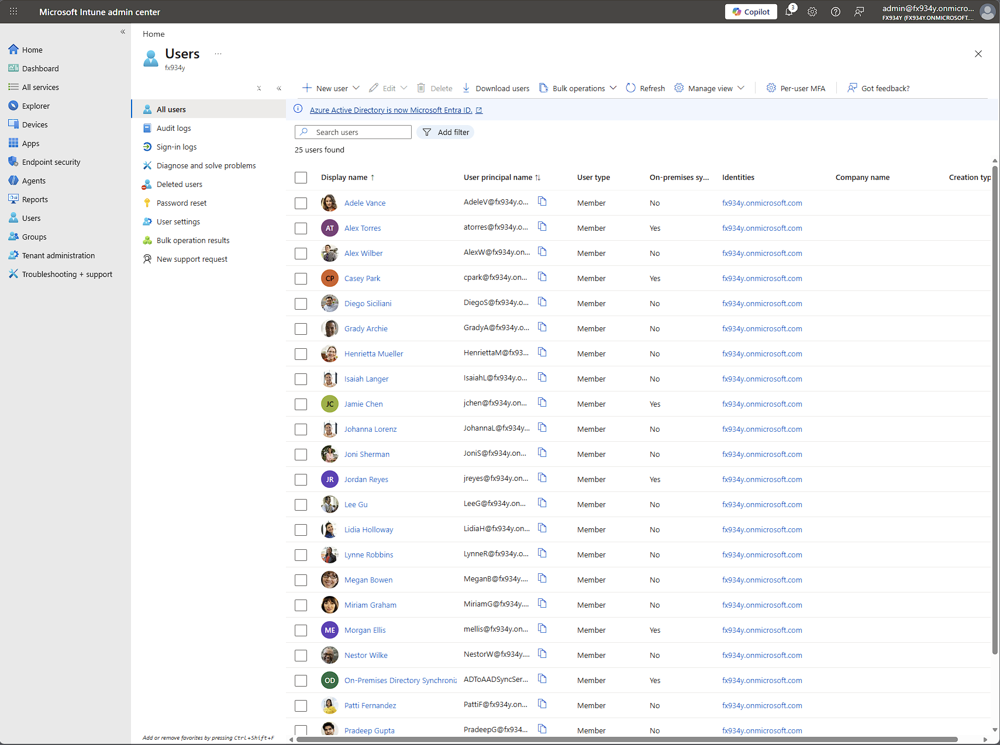
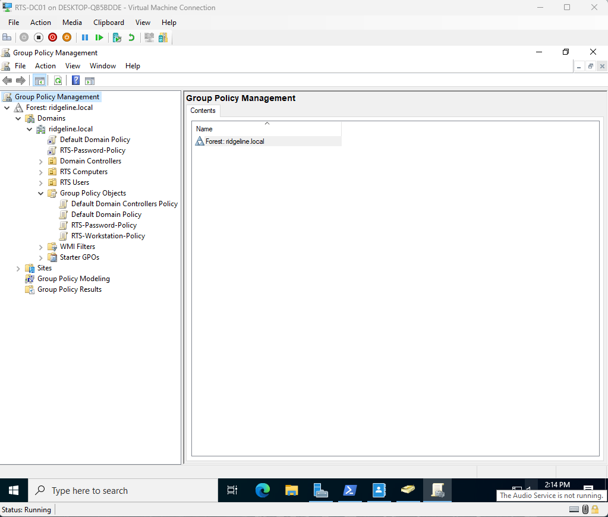
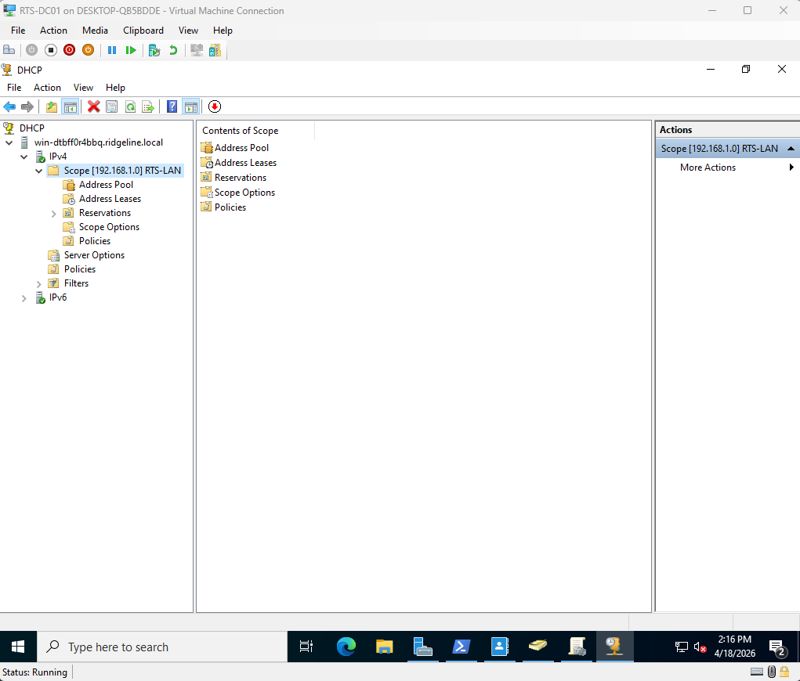
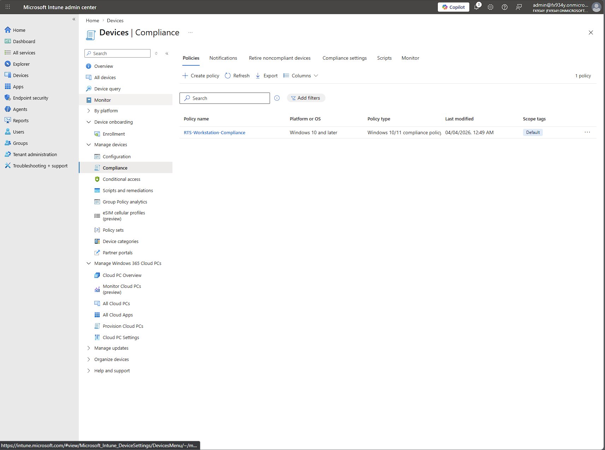
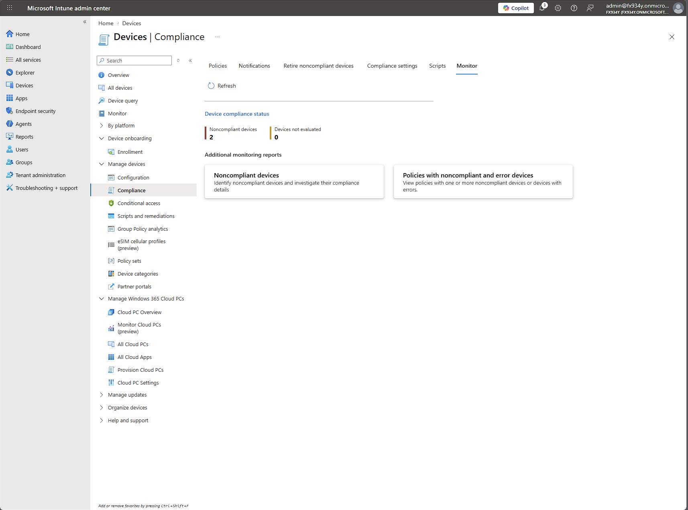
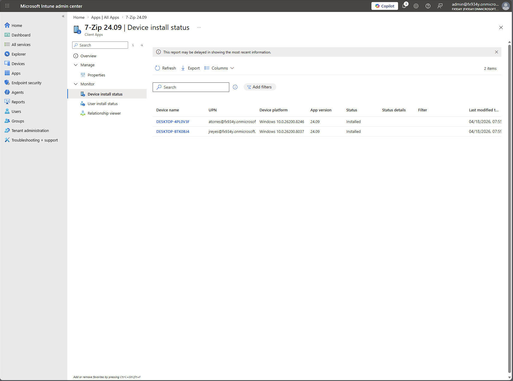
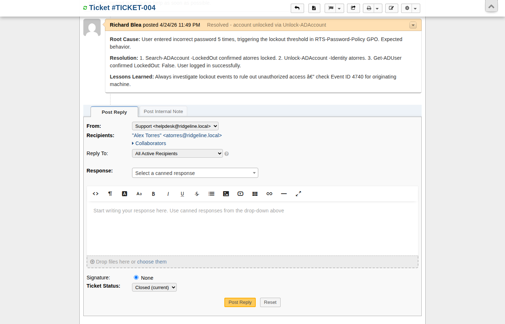
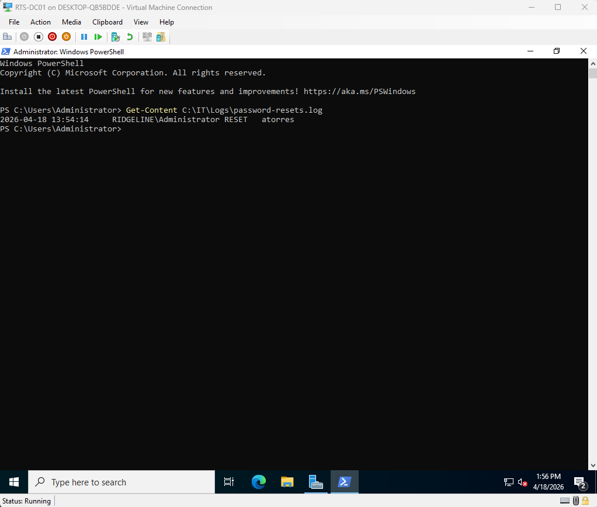

# Ridgeline Technology Services — IT Support Lab

A hands-on IT environment simulating the infrastructure of a 20-person company — built and operated end-to-end across Active Directory, Microsoft Intune, Entra ID, PowerShell automation, and a fully configured help desk.

[](https://www.linkedin.com/in/richard-blea-748914159)
[](https://github.com/Rblea97)

*B.S. Computer Science · Cybersecurity & Defense Certificate — University of Colorado Denver*


---

## What This Demonstrates

Hands-on competency in the day-to-day work of an entry-level IT support role, documented across a simulated 20-person business environment:

- **Service desk operations** — 8 support tickets worked end-to-end through a configured osTicket instance, with SLA tiers, priority matrix, and full lifecycle from triage to closure.
- **User account management** — new-employee onboarding, password resets with audit logging, account lockout resolution, group membership changes.
- **Endpoint management** — Windows 11 workstations enrolled in Microsoft Intune, compliance policies applied, software deployed remotely.
- **Cloud identity** — Microsoft 365 tenant with 6 users synced from on-premises Active Directory via Azure AD Connect.
- **File share permissions** — SMB share investigation including a Deny-overrides-Allow root cause analysis.
- **Documentation & automation** — 3 SOPs, 5 KB articles, asset register, and 5 PowerShell automation scripts.

Featured ticket walkthroughs and the help desk system are below.

---

## Skills Demonstrated

| Skill | Proof |
|---|---|
| Active Directory — user accounts, OU structure (Organizational Units — the folder system that organizes employees by department), and security groups | [New-RTSUser.ps1](scripts/New-RTSUser.ps1) · [Invoke-RTSOnboarding.ps1](scripts/Invoke-RTSOnboarding.ps1) · [TICKET-005](tickets/TICKET-005.md) |
| Group Policy — password enforcement, workstation hardening, and account lockout policy (Group Policy automatically applies security and configuration settings to every computer in the company) | [asset-register.md](docs/asset-register.md) · [TICKET-004](tickets/TICKET-004.md) |
| Microsoft Intune — MDM enrollment, compliance, and configuration profiles (MDM — Mobile Device Management — lets IT remotely manage and secure company computers) | [SOP: device-enrollment](docs/sops/device-enrollment.md) · [TICKET-003](tickets/TICKET-003.md) |
| Software deployment via Intune — Win32 app packaging and push to all enrolled devices (deploying software to every company computer automatically, without visiting each desk) | [SOP: software-deployment](docs/sops/software-deployment.md) · [TICKET-006](tickets/TICKET-006.md) |
| Azure AD / Entra ID — Connect sync and cloud identity (Entra ID syncs on-premises employee accounts to Microsoft 365 so the same login works for Teams, OneDrive, and email) | [TICKET-002](tickets/TICKET-002.md) · [Get-RTSComplianceReport.ps1](scripts/Get-RTSComplianceReport.ps1) |
| PowerShell automation — user provisioning, compliance reporting, and password management (scripts that automate repetitive IT tasks so technicians can focus on real problems) | [New-RTSUser.ps1](scripts/New-RTSUser.ps1) · [Reset-RTSUserPassword.ps1](scripts/Reset-RTSUserPassword.ps1) · [Get-RTSComplianceReport.ps1](scripts/Get-RTSComplianceReport.ps1) |
| DNS, DHCP, and SMB file shares — with least-privilege access control (DNS gives computers names; DHCP assigns network addresses; SMB file shares are the company file server, with access controlled per security group) | [asset-register.md](docs/asset-register.md) · [TICKET-008](tickets/TICKET-008.md) |
| End-user troubleshooting — systematic triage, investigation, and resolution documented for every incident (diagnosing and fixing the problems employees report, step by step) | [8 resolved tickets](tickets/) · [5 KB articles](docs/kb/) |
| Audit logging — password reset events written to a timestamped log on the domain controller (audit logs prove who changed what and when — required for security and compliance accountability) | [Reset-RTSUserPassword.ps1](scripts/Reset-RTSUserPassword.ps1) |
| Technical documentation — SOPs (step-by-step procedures), KB articles (solutions library), and an asset register (equipment inventory) | [SOP: new-user-onboarding](docs/sops/new-user-onboarding.md) · [asset-register.md](docs/asset-register.md) · [KB-001](docs/kb/KB-001-account-lockout.md) |
| Hyper-V virtualization — provisioned three virtual machines to simulate a real office network from scratch | [New-RTSLabVMs.ps1](scripts/setup/New-RTSLabVMs.ps1) |

---


*Active Directory — employee accounts organized into department folders (Operations, Finance, IT), mirroring how enterprise companies structure user management*


*Microsoft Intune — both company workstations enrolled, managed, and reporting compliance status remotely*


*osTicket help desk (an IT ticketing platform used by organizations of all sizes to track support requests) — 8 support incidents worked end-to-end, each documented with triage, investigation, resolution, and lessons learned*

---

Ridgeline Technology Services is a simulated IT environment modeled after a 20-person company. Every component — user accounts, device management, cloud identity, file shares, and the help desk — was built and configured from scratch to mirror what a technician manages at a small or mid-size company.

The lab runs a Windows Server 2022 domain controller, two Windows 11 workstations, and a Microsoft 365 tenant. On-premises Active Directory syncs to Entra ID (Microsoft's cloud identity platform) so the same employee credentials work across the office network and cloud services like Teams and OneDrive. All eight support tickets were worked end-to-end and documented to the standard of a professional IT team.

---

## Lab Architecture

The diagram below shows how the on-premises lab (left) connects to Microsoft 365 cloud services (right). DC01 is the main server — it manages user logins, assigns network addresses to devices, and keeps on-premises and cloud accounts synchronized.



| Asset | Hostname | OS | IP | Role |
|---|---|---|---|---|
| DC01 | WIN-DTBFF0R4BBQ | Windows Server 2022 | 192.168.1.10 | AD DS, DNS, DHCP, Azure AD Connect |
| WRK01 | DESKTOP-4PL0V3F | Windows 11 Pro | 192.168.1.102 | Domain workstation — atorres |
| WRK02 | DESKTOP-BTK0BJ4 | Windows 11 Pro | 192.168.1.103 | Domain workstation — jreyes |


*Entra ID — all 6 RTS users synced from on-premises Active Directory to Microsoft 365 via Azure AD Connect*

All VMs run on Hyper-V with an internal switch (`RTS-LAN 192.168.1.0/24`). DC01 has a second network adapter on the Default Switch for internet access. The domain `ridgeline.local` syncs to a Microsoft 365 tenant via Azure AD Connect using Password Hash Sync (a method that keeps passwords synchronized between the office network and the cloud without storing them in plaintext).

---

## What Was Built

1. **Active Directory** — domain `ridgeline.local`, 3 department OUs (Organizational Units — folders that organize accounts by department: Operations, Finance, IT), 6 users, 4 security groups
2. **DNS & DHCP** — DNS forwarder to 8.8.8.8, DHCP scope 192.168.1.100–200 on DC01 (DNS translates computer names to network addresses; DHCP automatically assigns those addresses to devices as they connect)
3. **Group Policy** — RTS-Password-Policy (10-character minimum password, lockout after 5 failed attempts), RTS-Workstation-Policy (Cortana disabled, lock screen settings)


*Group Policy Management Console — security and workstation policies linked to the domain and applied automatically to every computer*


*DHCP scope active on DC01 — automatically assigns network addresses to workstations as they connect to the lab network*

4. **Azure AD Connect** — Password Hash Sync configured, all 6 users synced from on-premises Active Directory to Entra ID (Microsoft's cloud identity platform for Microsoft 365)
5. **Microsoft Intune** — both workstations enrolled in MDM (Mobile Device Management), compliance policy (RTS-Workstation-Compliance) and configuration profile (RTS-Workstation-Config) applied


*Intune compliance policy — automatically checks that every managed device meets minimum security requirements before allowing access*


*Intune compliance monitor — both VMs flagged noncompliant due to no physical TPM chip in Hyper-V; documented as accepted risk in [TICKET-003](tickets/TICKET-003.md)*

6. **App Deployment** — 7-Zip 24.09 and Notepad++ 8.7.4 deployed to all devices via Intune Win32 app deployment (software pushed automatically to every enrolled computer — no manual installation required)


*Intune Win32 app deployment — 7-Zip installed automatically on all enrolled devices without touching either workstation*

7. **PowerShell Automation** — user onboarding, bulk user provisioning from CSV, compliance reporting via Microsoft Graph API, password reset with audit log, and Hyper-V lab provisioning
8. **Help Desk** — 8 support tickets worked end-to-end across account management, cloud identity, software deployment, and file share permissions; all resolved and documented

---

## The Service Desk

The lab includes a fully configured osTicket help desk that mirrors how an internal IT team intakes, triages, and resolves user-reported issues.

- **Departments:** IT Support (Tier 1), Infrastructure (Tier 2), Security (Tier 2)
- **SLA tiers:** Tier 1 Critical · Tier 2 High · Tier 3 Medium · Tier 4 Low
- **Priority matrix:** four-by-four impact/urgency grid documented in [`ticketing/docs/03-priority-matrix.md`](ticketing/docs/03-priority-matrix.md)

| ID | Subject | Priority | SLA | Status |
|----|---------|----------|-----|--------|
| 001 | DC hostname not renamed post-promotion | P4 Low | Tier 4 | Closed — accepted |
| 002 | Azure AD Cloud Sync agent disconnected | P2 High | Tier 2 | Closed — resolved |
| 003 | BitLocker compliance flag on lab VMs | P4 Low | Tier 4 | Closed — accepted risk |
| 004 | Account lockout — atorres on WRK01 | P2 High | Tier 2 | Closed — resolved |
| 005 | New employee onboarding — Jamie Chen | P3 Medium | Tier 3 | Closed — resolved |
| 006 | Software request — Notepad++ via Intune | P4 Low | Tier 4 | Closed — resolved |
| 007 | OneDrive sync error — invalid filename | P4 Low | Tier 4 | Closed — resolved |
| 008 | File share access denied — Finance$ | P3 Medium | Tier 3 | Closed — resolved |

Three of these are walked through below as featured incidents. Full lifecycle documentation: [`ticketing/`](ticketing/) · all 8 ticket files: [`tickets/`](tickets/)

---

## Featured Incidents

### TICKET-004 — Account Lockout

> A walkthrough of one support ticket from submission to closure, showing the full process a help desk technician follows to handle a real incident.

When an employee is locked out of their account, the instinct is to unlock it and move on. This walkthrough shows a more careful process: verify the lockout, investigate the cause, rule out unauthorized access, then resolve — and capture a lesson learned so the team handles it better next time.

#### The Incident

Alex Torres submitted a ticket through the IT support portal: *"I've been locked out of my account. I tried logging in several times and now I just get a lockout message."*

The ticket was automatically routed to the IT Support department based on the help topic selected. The technician assessed it as **P2 High** — one user affected, but she had no way to work at all.

#### Triage

Before touching anything, the technician evaluated the situation against the priority matrix:

- **Impact:** Medium — single user affected
- **Urgency:** High — user cannot log in, no workaround available
- **Result:** P2 High → **Tier 2 SLA — 4-hour response window, 8-hour resolution clock**

The SLA was escalated from the department default (Tier 3) based on urgency — a decision the technician made and documented.


*TICKET-004 closed — root cause, resolution steps, and lessons learned captured in the ticket before closing*

#### Investigation

Rather than immediately unlocking the account, the technician first confirmed the lockout and checked for signs of unauthorized access:

```powershell
# Confirm the account is locked
Search-ADAccount -LockedOut | Select-Object Name, SamAccountName, LockedOut
# Output: atorres — LockedOut: True

# Check Event ID 4740 to find the machine that triggered the lockout
Get-WinEvent -FilterHashtable @{LogName='Security'; Id=4740} | Select-Object -First 5
```

Five failed login attempts from WRK01 triggered the RTS-Password-Policy GPO lockout threshold (set at 5 attempts). Event ID 4740 is a Windows security log entry that records which machine triggered a lockout — checking it rules out unauthorized access before unlocking. No indicators of unauthorized access — a forgotten password, not a brute-force attempt.

#### Resolution

```powershell
# Unlock the account
Unlock-ADAccount -Identity atorres

# Verify the unlock succeeded
Get-ADUser atorres -Properties LockedOut | Select-Object Name, LockedOut
# Output: LockedOut: False
```

User confirmed successful login. Ticket closed within the 8-hour SLA window — **SLA met**.

#### Lessons Learned

Captured in the ticket before closing: always check Event ID 4740 to identify the source machine before unlocking — it distinguishes a forgotten password from a brute-force attack attempt. Future recommendation: enable self-service password reset (SSPR) via Entra ID to let users unlock their own accounts, reducing admin overhead for routine lockouts.

Full ticket documentation and the complete osTicket system: [`ticketing/`](ticketing/)

---

### TICKET-005 — New Employee Onboarding (Jamie Chen, Finance)

> A walkthrough of provisioning a new hire end-to-end — Active Directory account, security groups, cloud identity sync, and license assignment.

#### The Request

HR submitted a ticket: new hire **Jamie Chen** starting next week as a Financial Analyst. Standard onboarding — needs an AD account, Finance department access, and a Microsoft 365 license.

#### Triage

- **Impact:** Low — no current users blocked; future user pending start date
- **Urgency:** Medium — onboarding has a target start date
- **Result:** P3 Medium → Tier 3 SLA — 8-hour response, 24-hour resolution

Routed to IT Support per department default. No escalation needed.

#### Investigation

Verified domain password policy and OU structure before running the onboarding script:

```powershell
# Confirm OU exists
Get-ADOrganizationalUnit -Filter "Name -eq 'Finance'" -SearchBase "OU=RTS Users,DC=ridgeline,DC=local"

# Confirm domain password policy
Get-ADDefaultDomainPasswordPolicy | Select-Object MinPasswordLength, ComplexityEnabled
```

Output: minimum length **10 characters**, complexity enabled.

#### Resolution

```powershell
.\Invoke-RTSOnboarding.ps1 -FirstName Jamie -LastName Chen -Department Finance -JobTitle "Financial Analyst"
```

The script created the AD account in `OU=Finance,OU=RTS Users,DC=ridgeline,DC=local`, added Jamie to **All Staff** and **Finance Users** security groups, set UPN to `jchen@ridgelinets.onmicrosoft.com`, and triggered an Azure AD Connect delta sync. Microsoft 365 E5 Developer license assigned in `admin.microsoft.com` after the user appeared in the cloud directory (~3 minutes after sync).

#### Verification

```powershell
# Confirm account is enabled and group membership is correct
Get-ADUser jchen -Properties Enabled, MemberOf | Select-Object Name, Enabled
Get-ADPrincipalGroupMembership jchen | Select-Object Name
```

Output: `Enabled: True`. Groups: **All Staff**, **Finance Users**, **Domain Users**.

#### Lessons Learned

The first run of the onboarding script produced a disabled account because the script's default temporary password (9 characters) did not meet the domain password policy minimum of 10 characters. `New-ADUser` accepted the call but flagged the account disabled. Fix: validate script defaults against `Get-ADDefaultDomainPasswordPolicy` *before* deployment, not after a failed run. The script default has been replaced with a generated cryptographically-random temp password to remove this class of bug entirely.

Full ticket documentation: [`tickets/TICKET-005.md`](tickets/TICKET-005.md)

---

### TICKET-008 — File Share Access Denied (Finance$)

> A walkthrough of an SMB file share access investigation, including a classic Windows ACL gotcha that's easy to miss.

#### The Incident

Alex Torres (Operations) reported "Access Denied" when trying to open `\\WIN-DTBFF0R4BBQ\Finance$` for a cross-department project.

#### Triage

- **Impact:** Low — single user blocked from a single share
- **Urgency:** Medium — cross-department project work blocked
- **Result:** P3 Medium → Tier 3 SLA

#### Investigation

```powershell
# Check share-level permissions
Get-SmbShareAccess -Name 'Finance$'

# Check NTFS-level permissions on the underlying folder
(Get-Acl 'C:\Shares\Finance').Access |
    Select-Object IdentityReference, FileSystemRights, AccessControlType
```

Two findings:
1. The Finance$ share grants access to **Finance Users** only. Alex Torres was in **Operations Users**, not Finance Users — that alone explains the denial.
2. The share-level ACL also contained an explicit **Deny — Everyone** ACE from a `New-SmbShare -NoAccess 'Everyone'` mistake during initial setup.

The second finding is the trap: in Windows access control, **Deny ACEs always override Allow ACEs**. Even if Alex were added to Finance Users, the explicit Deny at the share level would still block her.

#### Resolution

```powershell
# Add user to the correct department group
Add-ADGroupMember -Identity 'Finance Users' -Members 'atorres'

# Rebuild the share without the explicit Deny ACE
Remove-SmbShare -Name 'Finance$' -Force
New-SmbShare -Name 'Finance$' `
    -Path 'C:\Shares\Finance' `
    -FullAccess 'RIDGELINE\Finance Users','BUILTIN\Administrators'
```

#### Verification

User ran `klist purge` to clear the cached Kerberos ticket, then logged off and back on to obtain a new token reflecting the Finance Users group membership.

```powershell
# Confirm group membership took effect after re-logon
whoami /groups | findstr "Finance"
```

Output included `RIDGELINE\Finance Users`. Access to `\\WIN-DTBFF0R4BBQ\Finance$` confirmed working.

#### Lessons Learned

- **Deny ACEs override Allow ACEs** in Windows access control. Avoid `-NoAccess` at the share level when NTFS permissions are already restrictive — it creates a trap that no amount of group-membership work can fix.
- Group membership changes require a new logon session. `gpupdate /force` alone is not sufficient because Kerberos tickets are issued at logon.
- In production, a ticketing/approval workflow should gate group additions to department shares — the change above was correct here, but in a real org it would need manager approval first.

Full ticket documentation: [`tickets/TICKET-008.md`](tickets/TICKET-008.md)

---

## Scripts

Automation scripts reduce time spent on repetitive tasks — creating accounts, resetting passwords, generating compliance reports — so technicians can focus on real problems. Each script is production-ready with error handling and logging.

| Script | Description |
|---|---|
| [`scripts/New-RTSUser.ps1`](scripts/New-RTSUser.ps1) | Bulk AD user creation from CSV with Entra ID sync |
| [`scripts/Invoke-RTSOnboarding.ps1`](scripts/Invoke-RTSOnboarding.ps1) | End-to-end single user onboarding — AD account, groups, and sync |
| [`scripts/Reset-RTSUserPassword.ps1`](scripts/Reset-RTSUserPassword.ps1) | Reset AD password with timestamped audit log entry |
| [`scripts/Get-RTSComplianceReport.ps1`](scripts/Get-RTSComplianceReport.ps1) | Export Intune device compliance report via Microsoft Graph API (OAuth2) |
| [`scripts/setup/New-RTSLabVMs.ps1`](scripts/setup/New-RTSLabVMs.ps1) | Provision Hyper-V virtual switch and 3 VMs with Gen 2, Secure Boot, and virtual TPM |


*Password reset audit log on DC01 — every reset is written to a timestamped file by Reset-RTSUserPassword.ps1, creating an auditable record of all account changes*

---

## Documentation

### Standard Operating Procedures

Step-by-step reference guides for common IT tasks — the kind of documentation a new technician follows on their first week and a senior tech updates after every process change.

| SOP | Description |
|---|---|
| [`docs/sops/new-user-onboarding.md`](docs/sops/new-user-onboarding.md) | End-to-end new employee setup — AD account, Entra ID sync, M365 license assignment |
| [`docs/sops/device-enrollment.md`](docs/sops/device-enrollment.md) | Enrolling a Windows 11 workstation into Intune MDM management |
| [`docs/sops/software-deployment.md`](docs/sops/software-deployment.md) | Packaging and deploying a Win32 application through Intune |

### Knowledge Base

Documented solutions to the most common support issues — written so any technician can resolve them without escalation.

| Article | Topic |
|---|---|
| [`KB-001`](docs/kb/KB-001-account-lockout.md) | Diagnosing and resolving locked Active Directory accounts |
| [`KB-002`](docs/kb/KB-002-new-user-onboarding.md) | New employee account setup reference |
| [`KB-003`](docs/kb/KB-003-software-request.md) | Handling software requests via Intune deployment |
| [`KB-004`](docs/kb/KB-004-onedrive-sync-error.md) | Resolving OneDrive invalid filename sync errors |
| [`KB-005`](docs/kb/KB-005-file-share-permissions.md) | Granting and revoking access to SMB file shares |

