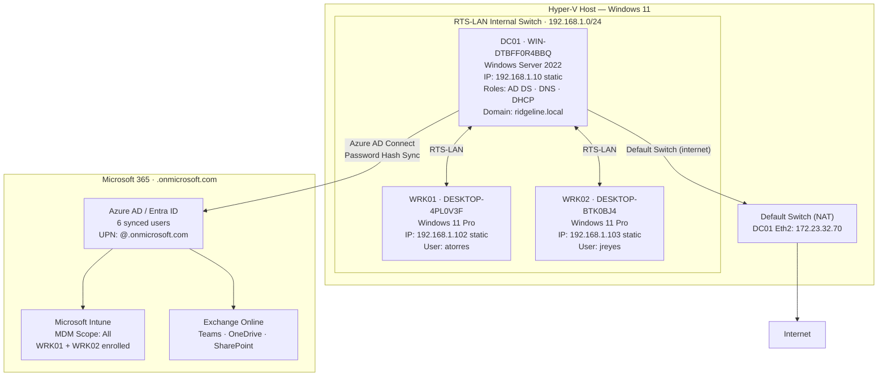

# Ridgeline Technology Services — Network Diagram

## Topology Overview

## Network Details

| Parameter | Value |
|---|---|
| Internal switch | RTS-LAN |
| Subnet | 192.168.1.0/24 |
| Domain controller IP | 192.168.1.10 (static) |
| DHCP scope | 192.168.1.100 – 192.168.1.200 |
| DHCP exclusions | 192.168.1.1 – 192.168.1.20 |
| DNS server (internal) | 192.168.1.10 (DC01) |
| DNS forwarder | 8.8.8.8 (Google) |
| Internet access | Hyper-V Default Switch (NAT), DC01 Ethernet 2 |

## Domain Information

| Parameter | Value |
|---|---|
| On-premises domain | ridgeline.local |
| NetBIOS name | RIDGELINE |
| Forest/domain functional level | Windows Server 2016 (WinThreshold) |
| Cloud tenant | <TENANT>.onmicrosoft.com |
| Sync method | Azure AD Connect (Entra Connect Sync) |
| Password sync | Password Hash Sync enabled |
| Sync interval | 30 minutes (delta sync) |
