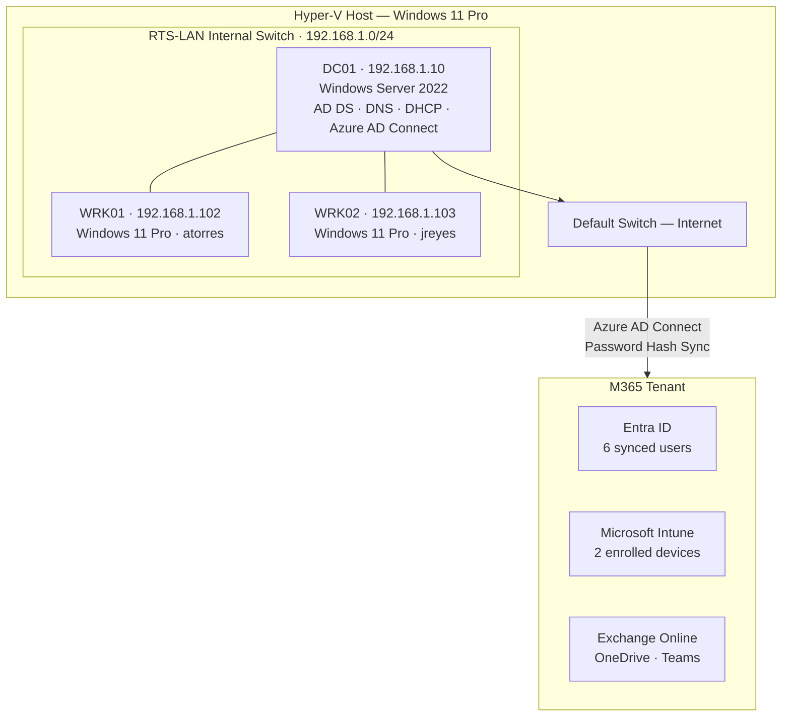

# Portfolio Polish Implementation Plan

> **For agentic workers:** REQUIRED SUB-SKILL: Use superpowers:subagent-driven-development (recommended) or superpowers:executing-plans to implement this plan task-by-task. Steps use checkbox (`- [ ]`) syntax for tracking.

**Goal:** Polish the ridgeline-it GitHub repo into a hiring-manager-ready portfolio piece targeting Systems Administrator / IT Support roles with a cybersecurity growth path.

**Architecture:** Seven sequential tasks — credential scrub, doc scrub, ticket scrub, setup script overhaul, .gitignore update, README overwrite, branch rename. Each task ends with a commit. No new features, no structural folder changes.

**Tech Stack:** Git, PowerShell, Markdown, Mermaid (GitHub-native rendering), shields.io badges

---

## Task 1: Scrub Credentials from Scripts

**Files:**
- Modify: `scripts/Get-RTSComplianceReport.ps1:32-33`
- Modify: `scripts/New-RTSUser.ps1:37`
- Modify: `scripts/Invoke-RTSOnboarding.ps1:46`

- [ ] **Step 1: Verify current credential locations**

```bash
grep -rn "fx934y\|a9566324\|14d82eec" scripts/
```

Expected output shows matches in Get-RTSComplianceReport.ps1 (lines 32-33), New-RTSUser.ps1 (line 37), Invoke-RTSOnboarding.ps1 (line 46).

- [ ] **Step 2: Scrub Get-RTSComplianceReport.ps1**

Replace:
```
    [string]$TenantId  = 'a9566324-fd0d-49ef-aa14-7ec036854bca',
    [string]$ClientId  = '14d82eec-204b-4c2f-b7e8-296a70dab67e', # Microsoft Graph PowerShell app
```
With:
```
    [string]$TenantId  = '<TENANT-ID>',
    [string]$ClientId  = '<CLIENT-ID>',
```

- [ ] **Step 3: Scrub New-RTSUser.ps1**

Replace:
```
$TenantDomain    = "fx934y.onmicrosoft.com"
```
With:
```
$TenantDomain    = "<TENANT>.onmicrosoft.com"
```

- [ ] **Step 4: Scrub Invoke-RTSOnboarding.ps1**

Replace:
```
$TenantDomain    = "fx934y.onmicrosoft.com"
```
With:
```
$TenantDomain    = "<TENANT>.onmicrosoft.com"
```

- [ ] **Step 5: Verify no credentials remain in scripts**

```bash
grep -rn "fx934y\|a9566324\|14d82eec" scripts/
```

Expected: no output.

- [ ] **Step 6: Commit**

```bash
git add scripts/Get-RTSComplianceReport.ps1 scripts/New-RTSUser.ps1 scripts/Invoke-RTSOnboarding.ps1
git commit -m "security: replace tenant IDs and domain with placeholders in scripts"
```

---

## Task 2: Scrub Credentials from Docs

**Files:**
- Modify: `docs/asset-register.md`
- Modify: `docs/sops/device-enrollment.md`
- Modify: `docs/sops/new-user-onboarding.md`
- Modify: `docs/sops/software-deployment.md`
- Modify: `docs/kb/KB-002-new-user-onboarding.md`
- Modify: `docs/kb/KB-003-software-request.md`
- Modify: `docs/network-diagram.md`

- [ ] **Step 1: Scrub docs/asset-register.md**

Replace all three occurrences — use replace_all on the domain:

| Old | New |
|---|---|
| `atorres@fx934y.onmicrosoft.com` | `atorres@<TENANT>.onmicrosoft.com` |
| `jreyes@fx934y.onmicrosoft.com` | `jreyes@<TENANT>.onmicrosoft.com` |
| `fx934y.onmicrosoft.com` (standalone tenant row) | `<TENANT>.onmicrosoft.com` |
| `admin@fx934y.onmicrosoft.com` | `admin@<TENANT>.onmicrosoft.com` |

- [ ] **Step 2: Scrub docs/sops/device-enrollment.md**

Four replacements:

| Old | New |
|---|---|
| `` `@fx934y.onmicrosoft.com` `` | `` `@<TENANT>.onmicrosoft.com` `` |
| `TenantInfo\a9566324-fd0d-49ef-aa14-7ec036854bca` | `TenantInfo\<TENANT-ID>` |
| `$tenantId = 'a9566324-fd0d-49ef-aa14-7ec036854bca'` | `$tenantId = '<TENANT-ID>'` |
| `admin@fx934y.onmicrosoft.com` | `admin@<TENANT>.onmicrosoft.com` |
| `<upn>@fx934y.onmicrosoft.com` | `<upn>@<TENANT>.onmicrosoft.com` |

- [ ] **Step 3: Scrub docs/sops/new-user-onboarding.md**

| Old | New |
|---|---|
| `admin@fx934y.onmicrosoft.com` | `admin@<TENANT>.onmicrosoft.com` |
| `flastname@fx934y.onmicrosoft.com` (two occurrences, use replace_all) | `flastname@<TENANT>.onmicrosoft.com` |

- [ ] **Step 4: Scrub docs/sops/software-deployment.md**

| Old | New |
|---|---|
| `admin@fx934y.onmicrosoft.com` | `admin@<TENANT>.onmicrosoft.com` |
| `C:\Users\Richie\Projects\IT\intune-staging\IntuneWinAppUtil.exe` | `<STAGING-PATH>\IntuneWinAppUtil.exe` |
| `C:\Users\Richie\Projects\IT\intune-staging\7zip\7z2409-x64.msi` | `<STAGING-PATH>\7zip\7z2409-x64.msi` |

- [ ] **Step 5: Scrub docs/kb/KB-002-new-user-onboarding.md**

| Old | New |
|---|---|
| `admin@fx934y.onmicrosoft.com` (two occurrences, use replace_all) | `admin@<TENANT>.onmicrosoft.com` |
| `<username>@fx934y.onmicrosoft.com` (two occurrences, use replace_all) | `<username>@<TENANT>.onmicrosoft.com` |
| `C:\Users\Richie\Projects\IT\ridgeline-it\scripts` | `<REPO-PATH>\scripts` |

- [ ] **Step 6: Scrub docs/kb/KB-003-software-request.md**

| Old | New |
|---|---|
| `C:\Users\Richie\Projects\IT\intune-staging\IntuneWinAppUtil.exe` | `<STAGING-PATH>\IntuneWinAppUtil.exe` |
| `C:\Users\Richie\Projects\IT\intune-staging\<appname>\<installer>` | `<STAGING-PATH>\<appname>\<installer>` |

- [ ] **Step 7: Scrub docs/network-diagram.md**

Replace `fx934y.onmicrosoft.com` with `<TENANT>.onmicrosoft.com` (3 occurrences — use replace_all).

- [ ] **Step 8: Verify no credentials remain in docs**

```bash
grep -rn "fx934y\|a9566324\|14d82eec\|Users\\Richie" docs/
```

Expected: no output.

- [ ] **Step 9: Commit**

```bash
git add docs/
git commit -m "security: replace tenant IDs, domain, and personal paths with placeholders in docs"
```

---

## Task 3: Scrub Credentials from Tickets

**Files:**
- Modify: `tickets/TICKET-002.md`
- Modify: `tickets/TICKET-003.md`
- Modify: `tickets/TICKET-005.md`
- Modify: `tickets/TICKET-006.md`
- Modify: `tickets/TICKET-007.md`

(TICKET-001, TICKET-004, TICKET-008 contain no tenant domain or personal paths — skip them.)

- [ ] **Step 1: Scrub tickets/TICKET-002.md**

| Old | New |
|---|---|
| `` `@fx934y.onmicrosoft.com` `` | `` `@<TENANT>.onmicrosoft.com` `` |

- [ ] **Step 2: Scrub tickets/TICKET-003.md**

| Old | New |
|---|---|
| `atorres@fx934y.onmicrosoft.com` | `atorres@<TENANT>.onmicrosoft.com` |
| `jreyes@fx934y.onmicrosoft.com` | `jreyes@<TENANT>.onmicrosoft.com` |

- [ ] **Step 3: Scrub tickets/TICKET-005.md**

| Old | New |
|---|---|
| `jchen@fx934y.onmicrosoft.com` (3 occurrences — use replace_all) | `jchen@<TENANT>.onmicrosoft.com` |

- [ ] **Step 4: Scrub tickets/TICKET-006.md**

| Old | New |
|---|---|
| `admin@fx934y.onmicrosoft.com` | `admin@<TENANT>.onmicrosoft.com` |
| `C:\Users\Richie\Projects\IT\intune-staging\notepadpp\npp.8.7.4.Installer.x64.exe` | `<STAGING-PATH>\notepadpp\npp.8.7.4.Installer.x64.exe` |

- [ ] **Step 5: Scrub tickets/TICKET-007.md**

| Old | New |
|---|---|
| `OneDrive for Business (fx934y.onmicrosoft.com)` | `OneDrive for Business (<TENANT>.onmicrosoft.com)` |

- [ ] **Step 6: Verify no credentials remain in tickets**

```bash
grep -rn "fx934y\|a9566324\|14d82eec\|Users\\Richie" tickets/
```

Expected: no output.

- [ ] **Step 7: Commit**

```bash
git add tickets/
git commit -m "security: replace tenant domain and personal paths with placeholders in tickets"
```

---

## Task 4: Overhaul Setup Script

**Files:**
- Modify: `scripts/setup/New-RTSLabVMs.ps1`

- [ ] **Step 1: Replace the entire file content**

Overwrite `scripts/setup/New-RTSLabVMs.ps1` with:

```powershell
<#
.SYNOPSIS
    Provisions the Ridgeline Technology Services Hyper-V lab environment.

.DESCRIPTION
    Creates the RTS-LAN internal virtual switch and three Generation 2 virtual machines:
    RTS-DC01 (Windows Server 2022), RTS-WRK01 (Windows 11), and RTS-WRK02 (Windows 11).

    WRK01 and WRK02 are created with virtual TPM enabled to support BitLocker compliance
    testing in Microsoft Intune. DC01 is created without TPM (not required for a domain controller).

    All VMs use dynamic memory (2-4 GB), 2 vCPUs, and 60 GB dynamic VHDX disks.
    Boot order: DVD -> HDD -> Network. Secure Boot enabled with MicrosoftUEFICertificateAuthority template.

.PARAMETER ISOPath
    Path to the folder containing the Windows Server 2022 and Windows 11 ISO files.
    Defaults to C:\ISOs.

    Expected filenames:
      SERVER_EVAL_x64FRE_en-us.iso  (Windows Server 2022 Evaluation)
      Win11_25H2_English_x64_v2.iso (Windows 11 25H2)

.EXAMPLE
    .\New-RTSLabVMs.ps1

.EXAMPLE
    .\New-RTSLabVMs.ps1 -ISOPath "D:\ISOs"

.NOTES
    Requires: Hyper-V PowerShell module
    Run as: Local Administrator on the Hyper-V host

    After running this script, install the operating systems on each VM via Hyper-V Manager,
    then run the AD configuration scripts from the repo.
#>

[CmdletBinding()]
param(
    [Parameter()]
    [string]$ISOPath = "C:\ISOs"
)

$ServerISO  = Join-Path $ISOPath "SERVER_EVAL_x64FRE_en-us.iso"
$Win11ISO   = Join-Path $ISOPath "Win11_25H2_English_x64_v2.iso"
$VHDPath    = (Get-VMHost).VirtualHardDiskPath
$SwitchName = "RTS-LAN"

# Virtual Switch
Write-Host "[1/4] Creating virtual switch '$SwitchName'..." -ForegroundColor Cyan
if (-not (Get-VMSwitch -Name $SwitchName -ErrorAction SilentlyContinue)) {
    New-VMSwitch -Name $SwitchName -SwitchType Internal | Out-Null
    Write-Host "      Created '$SwitchName'." -ForegroundColor Green
} else {
    Write-Host "      '$SwitchName' already exists - skipping." -ForegroundColor Yellow
}

# Helper: create a single VM
function New-RTSvm {
    param(
        [string]$Name,
        [string]$ISO,
        [bool]$EnableTPM
    )

    if (Get-VM -Name $Name -ErrorAction SilentlyContinue) {
        Write-Host "  '$Name' already exists - skipping." -ForegroundColor Yellow
        return
    }

    $vhdFile = Join-Path $VHDPath "$Name.vhdx"

    New-VM -Name $Name -Generation 2 -MemoryStartupBytes 4GB `
           -SwitchName $SwitchName -NewVHDPath $vhdFile -NewVHDSizeBytes 60GB | Out-Null

    Set-VMProcessor -VMName $Name -Count 2

    Set-VMMemory -VMName $Name -DynamicMemoryEnabled $true `
                 -MinimumBytes 2GB -StartupBytes 4GB -MaximumBytes 4GB

    Add-VMDvdDrive -VMName $Name -Path $ISO

    $dvd = Get-VMDvdDrive  -VMName $Name
    $hdd = Get-VMHardDiskDrive -VMName $Name
    $net = Get-VMNetworkAdapter -VMName $Name
    Set-VMFirmware -VMName $Name -BootOrder $dvd, $hdd, $net `
                   -EnableSecureBoot On `
                   -SecureBootTemplate "MicrosoftUEFICertificateAuthority"

    if ($EnableTPM) {
        Set-VMKeyProtector -VMName $Name -NewLocalKeyProtector
        Enable-VMTPM -VMName $Name
    }

    Write-Host "  $Name created." -ForegroundColor Green
}

# Create VMs
Write-Host "[2/4] Creating RTS-DC01 (Windows Server 2022)..." -ForegroundColor Cyan
New-RTSvm -Name "RTS-DC01" -ISO $ServerISO -EnableTPM $false

Write-Host "[3/4] Creating RTS-WRK01 (Windows 11)..." -ForegroundColor Cyan
New-RTSvm -Name "RTS-WRK01" -ISO $Win11ISO -EnableTPM $true

Write-Host "[4/4] Creating RTS-WRK02 (Windows 11)..." -ForegroundColor Cyan
New-RTSvm -Name "RTS-WRK02" -ISO $Win11ISO -EnableTPM $true

# Summary
Write-Host ""
Write-Host "VM Summary:" -ForegroundColor Cyan
Get-VM -Name "RTS-DC01","RTS-WRK01","RTS-WRK02" |
    Select-Object Name, State, Generation,
        @{N="RAM_GB"; E={[math]::Round($_.MemoryStartup/1GB,0)}},
        @{N="VHD"; E={(Get-VMHardDiskDrive $_.Name).Path}} |
    Format-Table -AutoSize

Write-Host "Switch:" -ForegroundColor Cyan
Get-VMSwitch -Name $SwitchName | Select-Object Name, SwitchType | Format-Table -AutoSize

Write-Host "Next: Install OSes on each VM via Hyper-V Manager, then run the AD configuration scripts." -ForegroundColor White
```

- [ ] **Step 2: Verify the file looks correct**

```bash
head -20 scripts/setup/New-RTSLabVMs.ps1
```

Expected: shows the `.SYNOPSIS` block and `[CmdletBinding()]` with `$ISOPath` parameter.

- [ ] **Step 3: Commit**

```bash
git add scripts/setup/New-RTSLabVMs.ps1
git commit -m "feat: add Hyper-V lab provisioning script with parameterized ISO path"
```

---

## Task 5: Update .gitignore

**Files:**
- Modify: `.gitignore`

- [ ] **Step 1: Add ISO image patterns to .gitignore**

Append to `.gitignore`:

```
# ISO and disk images
*.iso
*.img
```

- [ ] **Step 2: Commit**

```bash
git add .gitignore
git commit -m "chore: add ISO and disk image patterns to .gitignore"
```

---

## Task 6: Overwrite README.md

**Files:**
- Modify: `README.md`

- [ ] **Step 1: Overwrite README.md with the full new content**

Replace the entire contents of `README.md` with:

```markdown
# Ridgeline Technology Services — IT Support Lab

**Technician:** Richard Blea &nbsp;|&nbsp; **Status:** Complete &nbsp;|&nbsp; **Built:** April 2026


A hands-on home lab simulating the on-premises and cloud infrastructure of a 20-person company. Demonstrates the core skills required for a Systems Administrator or IT Support role: Active Directory, Microsoft Intune MDM, Entra ID, PowerShell automation, and end-user support.

---

## What This Demonstrates

| Skill | Proof |
|---|---|
| Active Directory — OU design, user/group management | [New-RTSUser.ps1](scripts/New-RTSUser.ps1) · [Invoke-RTSOnboarding.ps1](scripts/Invoke-RTSOnboarding.ps1) · [TICKET-005](tickets/TICKET-005.md) |
| Group Policy — password policy, workstation hardening | [asset-register.md](docs/asset-register.md) · [TICKET-004](tickets/TICKET-004.md) |
| Microsoft Intune — MDM enrollment, compliance, config profiles | [SOP: device-enrollment](docs/sops/device-enrollment.md) · [TICKET-003](tickets/TICKET-003.md) |
| Win32 App Deployment via Intune | [SOP: software-deployment](docs/sops/software-deployment.md) · [TICKET-006](tickets/TICKET-006.md) |
| Azure AD / Entra ID — Connect sync, cloud identity | [TICKET-002](tickets/TICKET-002.md) · [Get-RTSComplianceReport.ps1](scripts/Get-RTSComplianceReport.ps1) |
| PowerShell Automation — AD module, Graph API, Hyper-V | [scripts/](scripts/) |
| DNS, DHCP, SMB file shares | [asset-register.md](docs/asset-register.md) · [TICKET-008](tickets/TICKET-008.md) |
| End-user troubleshooting — systematic diagnosis | [8 resolved tickets](tickets/) · [5 KB articles](docs/kb/) |
| Technical documentation — SOPs, KB, asset register | [docs/](docs/) |
| Hyper-V lab provisioning | [New-RTSLabVMs.ps1](scripts/setup/New-RTSLabVMs.ps1) |

---

## Security Relevance

This lab demonstrates security fundamentals that map directly to cybersecurity roles:

| Concept | Implementation |
|---|---|
| **Least Privilege** | Security groups (Operations Users, Finance Users, IT Staff) restrict SMB share access — [TICKET-008](tickets/TICKET-008.md) |
| **Audit Logging** | Password resets written to a timestamped audit log on DC01 — [Reset-RTSUserPassword.ps1](scripts/Reset-RTSUserPassword.ps1) |
| **Compliance Enforcement** | Intune compliance policy enforces OS version and encryption requirements across all enrolled devices — [TICKET-003](tickets/TICKET-003.md) |
| **Identity Lifecycle Management** | Users provisioned in AD, synced to Entra ID, licensed in M365 — [TICKET-005](tickets/TICKET-005.md) |
| **GPO Security Baseline** | Password complexity (10-char min), account lockout (5 attempts / 30-min window) via Group Policy — [TICKET-004](tickets/TICKET-004.md) |
| **OAuth2 / Graph API Auth** | Compliance report authenticates via OAuth2 device code flow to Microsoft Graph — [Get-RTSComplianceReport.ps1](scripts/Get-RTSComplianceReport.ps1) |
| **ACL Troubleshooting** | Diagnosed explicit Deny ACE overriding Allow permissions on Finance$ SMB share — [TICKET-008](tickets/TICKET-008.md) |

---

## Lab Architecture



| Asset | Hostname | OS | IP | Role |
|---|---|---|---|---|
| DC01 | WIN-DTBFF0R4BBQ | Windows Server 2022 | 192.168.1.10 | AD DS, DNS, DHCP, Azure AD Connect |
| WRK01 | DESKTOP-4PL0V3F | Windows 11 Pro | 192.168.1.102 | Domain workstation — atorres |
| WRK02 | DESKTOP-BTK0BJ4 | Windows 11 Pro | 192.168.1.103 | Domain workstation — jreyes |

All VMs run on Hyper-V with an internal switch (`RTS-LAN 192.168.1.0/24`). DC01 has a second NIC on the Default Switch for internet access. The domain `ridgeline.local` syncs to a Microsoft 365 tenant via Azure AD Connect (Password Hash Sync).

---

## What Was Built

1. **Active Directory** — domain `ridgeline.local`, 3 department OUs (Operations, Finance, IT), 6 users, 4 security groups
2. **DNS & DHCP** — DNS forwarder to 8.8.8.8, DHCP scope 192.168.1.100–200 on DC01
3. **Group Policy** — RTS-Password-Policy (10-char min, lockout after 5 attempts), RTS-Workstation-Policy (Cortana block, lock screen)
4. **Azure AD Connect** — Password Hash Sync, all 6 users synced to Entra ID
5. **Microsoft Intune** — both workstations enrolled, compliance policy (RTS-Workstation-Compliance), configuration profile (RTS-Workstation-Config)
6. **Win32 App Deployment** — 7-Zip 24.09 and Notepad++ 8.7.4 deployed to all devices via Intune
7. **PowerShell Automation** — user onboarding, bulk provisioning, compliance reporting, password reset with audit log, Hyper-V lab provisioning
8. **Support Scenarios** — 8 tickets worked end-to-end across account management, cloud identity, software deployment, and file share permissions

---

## Scripts

| Script | Description |
|---|---|
| [`scripts/New-RTSUser.ps1`](scripts/New-RTSUser.ps1) | Bulk AD user creation from CSV with Entra ID sync |
| [`scripts/Invoke-RTSOnboarding.ps1`](scripts/Invoke-RTSOnboarding.ps1) | End-to-end single user onboarding — AD account, groups, and sync |
| [`scripts/Reset-RTSUserPassword.ps1`](scripts/Reset-RTSUserPassword.ps1) | Reset AD password with timestamped audit log entry |
| [`scripts/Get-RTSComplianceReport.ps1`](scripts/Get-RTSComplianceReport.ps1) | Export Intune device compliance report via Microsoft Graph API (OAuth2) |
| [`scripts/setup/New-RTSLabVMs.ps1`](scripts/setup/New-RTSLabVMs.ps1) | Provision Hyper-V virtual switch and 3 VMs with Gen 2, Secure Boot, and virtual TPM |

---

## Documentation

### Standard Operating Procedures

| SOP | Description |
|---|---|
| [`docs/sops/new-user-onboarding.md`](docs/sops/new-user-onboarding.md) | End-to-end new employee setup — AD, Entra ID sync, M365 license |
| [`docs/sops/device-enrollment.md`](docs/sops/device-enrollment.md) | Intune MDM enrollment for domain-joined Windows 11 devices |
| [`docs/sops/software-deployment.md`](docs/sops/software-deployment.md) | Win32 app packaging and deployment via Intune |

### Knowledge Base

| Article | Topic |
|---|---|
| [`KB-001`](docs/kb/KB-001-account-lockout.md) | Unlocking locked AD accounts |
| [`KB-002`](docs/kb/KB-002-new-user-onboarding.md) | New employee setup reference |
| [`KB-003`](docs/kb/KB-003-software-request.md) | Software deployment via Intune |
| [`KB-004`](docs/kb/KB-004-onedrive-sync-error.md) | Resolving OneDrive invalid filename errors |
| [`KB-005`](docs/kb/KB-005-file-share-permissions.md) | Granting and revoking file share access |

### Support Tickets

| Ticket | Summary | Status |
|---|---|---|
| [TICKET-001](tickets/TICKET-001.md) | DC hostname not renamed post-promotion | Closed — accepted |
| [TICKET-002](tickets/TICKET-002.md) | Azure AD Cloud Sync blocked by network — switched to AD Connect | Closed — resolved |
| [TICKET-003](tickets/TICKET-003.md) | BitLocker non-compliance on lab VMs (no TPM) | Closed — accepted risk |
| [TICKET-004](tickets/TICKET-004.md) | Account lockout — atorres locked after 5 failed login attempts | Closed — resolved |
| [TICKET-005](tickets/TICKET-005.md) | New employee onboarding — Jamie Chen, Finance | Closed — resolved |
| [TICKET-006](tickets/TICKET-006.md) | Software request — Notepad++ deployment via Intune | Closed — resolved |
| [TICKET-007](tickets/TICKET-007.md) | OneDrive sync error — invalid filename characters | Closed — resolved |
| [TICKET-008](tickets/TICKET-008.md) | File share access denied — Finance$ SMB share | Closed — resolved |

---

## Screenshots

Deployment proof in [`screenshots/`](screenshots/):

| File | Shows |
|---|---|
| `01-aduc-ous.png` | AD Users and Computers — RTS OU structure and users |
| `02-azure-ad-users.png` | Entra ID — synced RTS users in M365 admin center |
| `03-intune-devices.png` | Intune — both workstations enrolled and managed |
| `04-compliance-policy.png` | Intune — RTS-Workstation-Compliance policy |
| `04b-compliance-status.png` | Intune — compliance monitor showing noncompliant: 2 |
| `05-7zip-deployed.png` | Intune — 7-Zip installed on both devices |
| `06-gpo-console.png` | GPMC — RTS-Password-Policy and RTS-Workstation-Policy |
| `07-dhcp-scope.png` | DHCP — Scope 192.168.1.0 RTS-LAN |
| `08-password-reset-log.png` | DC01 — password reset audit log entry |
```

- [ ] **Step 2: Verify the README renders correctly**

Open `README.md` in a markdown previewer or check that:
- Badges line appears after the header line
- Mermaid block is fenced with triple backticks and `mermaid` tag
- All internal links use relative paths (no `./` prefix needed for GitHub)

- [ ] **Step 3: Commit**

```bash
git add README.md
git commit -m "docs: overhaul README for portfolio — hero, skills table, security relevance, Mermaid diagram"
```

---

## Task 7: Rename Branch and Prepare for Push

- [ ] **Step 1: Rename local branch master → main**

```bash
git branch -m master main
```

- [ ] **Step 2: Verify branch name**

```bash
git branch
```

Expected output: `* main`

- [ ] **Step 3: Verify clean status**

```bash
git status
git log --oneline -10
```

Expected: working tree clean. Log shows all commits from this plan plus original history.

- [ ] **Step 4: Final credential scan across entire repo**

```bash
grep -rn "fx934y\|a9566324\|14d82eec\|Users\\Richie" --include="*.md" --include="*.ps1" . | grep -v ".git" | grep -v "superpowers"
```

Expected: no output.

- [ ] **Step 5: Push to GitHub**

```bash
git push -u origin main
```

Expected: branch pushed, GitHub sets `main` as default branch. Visit `https://github.com/Rblea97/ridgeline-it` to confirm README renders with badges and Mermaid diagram.

---

## Self-Review Checklist

**Spec coverage:**
- [x] Section 1 (README overhaul) → Task 6
- [x] Section 2 (credential scrub) → Tasks 1, 2, 3
- [x] Section 3 (setup script) → Task 4
- [x] Section 4 (Mermaid diagram) → Task 6 (embedded in README)
- [x] Section 5 (housekeeping — branch, .gitignore) → Tasks 5, 7

**Placeholder scan:** No TBDs. Every step has exact strings or exact commands.

**Consistency:** Placeholder format `<TENANT>.onmicrosoft.com` used consistently across all 7 tasks. No variation in placeholder names.
