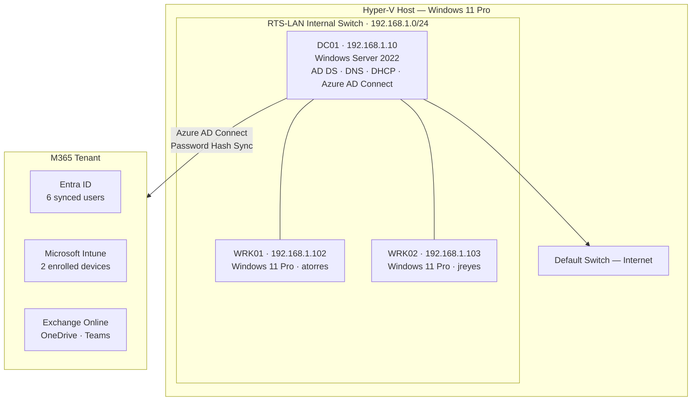

# README Revamp Implementation Plan

> **For agentic workers:** REQUIRED SUB-SKILL: Use superpowers:subagent-driven-development (recommended) or superpowers:executing-plans to implement this plan task-by-task. Steps use checkbox (`- [ ]`) syntax for tracking.

**Goal:** Rewrite `README.md` to serve as a recruiter-facing IT portfolio piece accessible to non-technical hiring managers, showcasing the full lab — Active Directory, Intune, Entra ID, PowerShell, and the help desk ticketing system.

**Architecture:** Single file rewrite (`README.md`). Content is reorganized and reframed — skills first, screenshots early, TICKET-004 walkthrough surfaced as a featured section, no student language, no "What's Next", security skills folded into the main skills table rather than called out as a career pivot. Ticketing screenshots referenced from `ticketing/screenshots/` using relative paths. No other files modified.

**Tech Stack:** Markdown, GitHub Flavored Markdown (shields.io badges, Mermaid diagram, inline images)

---

## File Map

| File | Change |
|---|---|
| `README.md` | Full rewrite — Tasks 1–6 build this progressively |

All other files are referenced but not modified.

---

### Task 1: Write the header and Skills Demonstrated table

**Files:**
- Modify: `README.md` (replace entire file — start fresh)

- [ ] **Step 1: Replace README.md with the new header + skills table**

Write the following as the complete content of `README.md`:

```markdown
# Ridgeline Technology Services — IT Support Lab

A hands-on IT environment simulating the infrastructure of a 20-person company — built and operated end-to-end across Active Directory, Microsoft Intune, Entra ID, PowerShell automation, and a fully configured help desk.

[](https://www.linkedin.com/in/richard-blea-748914159)
[](https://github.com/Rblea97)

*B.S. Computer Science · Cybersecurity & Defense Certificate — University of Colorado Denver*


---

## Skills Demonstrated

| Skill | Proof |
|---|---|
| Active Directory — user accounts, OU structure (Organizational Units — the folder system that organizes employees by department), and security groups | [New-RTSUser.ps1](scripts/New-RTSUser.ps1) · [Invoke-RTSOnboarding.ps1](scripts/Invoke-RTSOnboarding.ps1) · [TICKET-005](tickets/TICKET-005.md) |
| Group Policy — password enforcement, workstation hardening, and account lockout policy (Group Policy automatically applies security and configuration settings to every computer in the company) | [asset-register.md](docs/asset-register.md) · [TICKET-004](tickets/TICKET-004.md) |
| Microsoft Intune — MDM enrollment, compliance, and configuration profiles (MDM — Mobile Device Management — lets IT remotely manage and secure company computers) | [SOP: device-enrollment](docs/sops/device-enrollment.md) · [TICKET-003](tickets/TICKET-003.md) |
| Software deployment via Intune — Win32 app packaging and push to all enrolled devices (deploying software to every company computer automatically, without visiting each desk) | [SOP: software-deployment](docs/sops/software-deployment.md) · [TICKET-006](tickets/TICKET-006.md) |
| Azure AD / Entra ID — Connect sync and cloud identity (Entra ID syncs on-premises employee accounts to Microsoft 365 so the same login works for Teams, OneDrive, and email) | [TICKET-002](tickets/TICKET-002.md) · [Get-RTSComplianceReport.ps1](scripts/Get-RTSComplianceReport.ps1) |
| PowerShell automation — user provisioning, compliance reporting, and password management (scripts that automate repetitive IT tasks so technicians can focus on real problems) | [scripts/](scripts/) |
| DNS, DHCP, and SMB file shares — with least-privilege access control (DNS gives computers names; DHCP assigns network addresses; SMB file shares are the company file server, with access controlled per security group) | [asset-register.md](docs/asset-register.md) · [TICKET-008](tickets/TICKET-008.md) |
| End-user troubleshooting — systematic triage, investigation, and resolution documented for every incident | [8 resolved tickets](tickets/) · [5 KB articles](docs/kb/) |
| Audit logging — password reset events written to a timestamped log on the domain controller | [Reset-RTSUserPassword.ps1](scripts/Reset-RTSUserPassword.ps1) |
| Technical documentation — SOPs (step-by-step procedures), KB articles (solutions library), and an asset register (equipment inventory) | [docs/](docs/) |
| Hyper-V virtualization — provisioned three virtual machines to simulate a real office network from scratch | [New-RTSLabVMs.ps1](scripts/setup/New-RTSLabVMs.ps1) |
```

- [ ] **Step 2: Verify**

Open `README.md` and confirm:
- LinkedIn and GitHub badges appear at the top before scrolling
- Credentials line is present and reads correctly
- Skills table has 11 rows including audit logging
- Every row in the skills table has parenthetical jargon explanations
- No mention of "graduating", "student", "learning", "What's Next", or "Security Relevance"

- [ ] **Step 3: Commit**

```bash
git add README.md
git commit -m "docs: revamp README header and skills table for recruiter audience"
```

---

### Task 2: Add hero screenshots and intro paragraph

**Files:**
- Modify: `README.md` (append after skills table)

- [ ] **Step 1: Append hero screenshots and intro paragraph**

Add the following after the closing `|` of the skills table:

```markdown

---


*Active Directory — employee accounts organized into department folders (Operations, Finance, IT), mirroring how enterprise companies structure user management*


*Microsoft Intune — both company workstations enrolled, managed, and reporting compliance status remotely*


*osTicket help desk (an IT ticketing platform used by organizations of all sizes to track support requests) — 8 support incidents worked end-to-end, each documented with triage, investigation, resolution, and lessons learned*

---

Ridgeline Technology Services is a simulated IT environment modeled after a 20-person company. Every component — user accounts, device management, cloud identity, file shares, and the help desk — was built and configured from scratch to mirror what a technician manages at a small or mid-size company.

The lab runs a Windows Server 2022 domain controller, two Windows 11 workstations, and a Microsoft 365 tenant. On-premises Active Directory syncs to Entra ID (Microsoft's cloud identity platform) so the same employee credentials work across the office network and cloud services like Teams and OneDrive. All eight support tickets were worked end-to-end and documented to the standard of a professional IT team.
```

- [ ] **Step 2: Verify**

Confirm all three screenshots render correctly by checking the paths exist:
```bash
ls ./screenshots/01-aduc-ous.png ./screenshots/03-intune-devices.png ./ticketing/screenshots/04-ticket-queue.png
```
Expected: all three files listed with no errors.

Confirm the intro paragraph contains no student language, no graduation date, and reads in present tense.

- [ ] **Step 3: Commit**

```bash
git add README.md
git commit -m "docs: add hero screenshots and intro paragraph"
```

---

### Task 3: Add Lab Architecture section

**Files:**
- Modify: `README.md` (append after intro paragraph)

- [ ] **Step 1: Append the Lab Architecture section**

Add the following after the intro paragraph:

```markdown

---

## Lab Architecture

The diagram below shows how the on-premises lab (left) connects to Microsoft 365 cloud services (right). DC01 is the main server — it manages user logins, assigns network addresses to devices, and keeps on-premises and cloud accounts synchronized.



| Asset | Hostname | OS | IP | Role |
|---|---|---|---|---|
| DC01 | WIN-DTBFF0R4BBQ | Windows Server 2022 | 192.168.1.10 | AD DS, DNS, DHCP, Azure AD Connect |
| WRK01 | DESKTOP-4PL0V3F | Windows 11 Pro | 192.168.1.102 | Domain workstation — atorres |
| WRK02 | DESKTOP-BTK0BJ4 | Windows 11 Pro | 192.168.1.103 | Domain workstation — jreyes |


*Entra ID — all 6 RTS users synced from on-premises Active Directory to Microsoft 365 via Azure AD Connect*

All VMs run on Hyper-V with an internal switch (`RTS-LAN 192.168.1.0/24`). DC01 has a second network adapter on the Default Switch for internet access. The domain `ridgeline.local` syncs to a Microsoft 365 tenant via Azure AD Connect using Password Hash Sync (a method that keeps passwords synchronized between the office network and the cloud without storing them in plaintext).
```

- [ ] **Step 2: Verify**

```bash
ls ./screenshots/02-azure-ad-users.png
```
Expected: file exists.

Confirm the plain-English sentence above the Mermaid diagram is present and the diagram is unchanged from the original README.

- [ ] **Step 3: Commit**

```bash
git add README.md
git commit -m "docs: add lab architecture section with inline screenshot"
```

---

### Task 4: Add What Was Built section with inline screenshots

**Files:**
- Modify: `README.md` (append after Lab Architecture section)

- [ ] **Step 1: Append What Was Built with inline screenshots**

Add the following after the Lab Architecture section:

```markdown

---

## What Was Built

1. **Active Directory** — domain `ridgeline.local`, 3 department OUs (Organizational Units — folders that organize accounts by department: Operations, Finance, IT), 6 users, 4 security groups
2. **DNS & DHCP** — DNS forwarder to 8.8.8.8, DHCP scope 192.168.1.100–200 on DC01 (DNS translates computer names to network addresses; DHCP automatically assigns those addresses to devices as they connect)
3. **Group Policy** — RTS-Password-Policy (10-character minimum password, lockout after 5 failed attempts), RTS-Workstation-Policy (Cortana disabled, lock screen settings)


*Group Policy Management Console — security and workstation policies linked to the domain and applied automatically to every computer*


*DHCP scope active on DC01 — automatically assigns network addresses to workstations as they connect to the lab network*

4. **Azure AD Connect** — Password Hash Sync configured, all 6 users synced from on-premises Active Directory to Entra ID (Microsoft's cloud identity platform for Microsoft 365)
5. **Microsoft Intune** — both workstations enrolled in MDM (Mobile Device Management), compliance policy (RTS-Workstation-Compliance) and configuration profile (RTS-Workstation-Config) applied


*Intune compliance policy — automatically checks that every managed device meets minimum security requirements before allowing access*


*Intune compliance monitor — both VMs flagged noncompliant due to no physical TPM chip in Hyper-V; documented as accepted risk in [TICKET-003](tickets/TICKET-003.md)*

6. **App Deployment** — 7-Zip 24.09 and Notepad++ 8.7.4 deployed to all devices via Intune Win32 app deployment (software pushed automatically to every enrolled computer — no manual installation required)


*Intune Win32 app deployment — 7-Zip installed automatically on all enrolled devices without touching either workstation*

7. **PowerShell Automation** — user onboarding, bulk user provisioning from CSV, compliance reporting via Microsoft Graph API, password reset with audit log, and Hyper-V lab provisioning
8. **Help Desk** — 8 support tickets worked end-to-end across account management, cloud identity, software deployment, and file share permissions; all resolved and documented
```

- [ ] **Step 2: Verify**

```bash
ls ./screenshots/06-gpo-console.png ./screenshots/07-dhcp-scope.png ./screenshots/04-compliance-policy.png ./screenshots/04b-compliance-status.png ./screenshots/05-7zip-deployed.png
```
Expected: all five files listed with no errors.

Confirm parentheticals are present on items 1, 2, 4, 5, and 6. Confirm item 3 has the GPO and DHCP screenshots inline, item 5 has the compliance screenshots inline, item 6 has the app deployment screenshot inline.

- [ ] **Step 3: Commit**

```bash
git add README.md
git commit -m "docs: add what was built section with inline screenshots"
```

---

### Task 5: Add Featured Incident — TICKET-004

**Files:**
- Modify: `README.md` (append after What Was Built)

- [ ] **Step 1: Append the TICKET-004 featured section**

Add the following after the What Was Built section:

```markdown

---

## Featured Incident: TICKET-004 — Account Lockout

> A walkthrough of one support ticket from submission to closure, showing the full process a help desk technician follows to handle a real incident.

When an employee is locked out of their account, the instinct is to unlock it and move on. This walkthrough shows a more careful process: verify the lockout, investigate the cause, rule out unauthorized access, then resolve — and capture a lesson learned so the team handles it better next time.

### The Incident

Alex Torres submitted a ticket through the IT support portal: *"I've been locked out of my account. I tried logging in several times and now I just get a lockout message."*

The ticket was automatically routed to the IT Support department based on the help topic selected. The technician assessed it as **P2 High** — one user affected, but she had no way to work at all.

### Triage

Before touching anything, the technician evaluated the situation against the priority matrix:

- **Impact:** Medium — single user affected
- **Urgency:** High — user cannot log in, no workaround available
- **Result:** P2 High → **Tier 2 SLA — 4-hour response window, 8-hour resolution clock**

The SLA was escalated from the department default (Tier 3) based on urgency — a decision the technician made and documented.


*TICKET-004 closed — root cause, resolution steps, and lessons learned captured in the ticket before closing*

### Investigation

Rather than immediately unlocking the account, the technician first confirmed the lockout and checked for signs of unauthorized access:

```powershell
# Confirm the account is locked
Search-ADAccount -LockedOut | Select-Object Name, SamAccountName, LockedOut
# Output: atorres — LockedOut: True

# Check Event ID 4740 to find the machine that triggered the lockout
Get-WinEvent -FilterHashtable @{LogName='Security'; Id=4740} | Select-Object -First 5
```

Five failed login attempts from WRK01 triggered the RTS-Password-Policy GPO lockout threshold (set at 5 attempts). No indicators of unauthorized access — a forgotten password, not a brute-force attempt.

### Resolution

```powershell
# Unlock the account
Unlock-ADAccount -Identity atorres

# Verify the unlock succeeded
Get-ADUser atorres -Properties LockedOut | Select-Object Name, LockedOut
# Output: LockedOut: False
```

User confirmed successful login. Ticket closed within the 8-hour SLA window — **SLA met**.

### Lessons Learned

Captured in the ticket before closing: always check Event ID 4740 to identify the source machine before unlocking — it distinguishes a forgotten password from a brute-force attack attempt. Future recommendation: enable self-service password reset (SSPR) via Entra ID to let users unlock their own accounts, reducing admin overhead for routine lockouts.

Full ticket documentation and the complete osTicket system: [`ticketing/`](ticketing/)

---
```

- [ ] **Step 2: Verify**

```bash
ls ./ticketing/screenshots/05-ticket-004-detail.png
```
Expected: file exists.

Read the section and confirm:
- The walkthrough reads clearly without any assumed technical knowledge
- Every technical term (SLA, Event ID 4740, GPO, SSPR) has a plain-English explanation in context
- PowerShell commands are shown with their expected output
- Lessons Learned is present
- No mention of "cybersecurity career", "transferring to cyber", or any flight-risk language

- [ ] **Step 3: Commit**

```bash
git add README.md
git commit -m "docs: add featured TICKET-004 account lockout walkthrough"
```

---

### Task 6: Add Scripts and Documentation sections, verify success criteria

**Files:**
- Modify: `README.md` (append remaining sections, verify full document)

- [ ] **Step 1: Append Scripts section**

Add the following after the TICKET-004 section:

```markdown
## Scripts

Automation scripts reduce time spent on repetitive tasks — creating accounts, resetting passwords, generating compliance reports — so technicians can focus on real problems. Each script is production-ready with error handling and logging.

| Script | Description |
|---|---|
| [`scripts/New-RTSUser.ps1`](scripts/New-RTSUser.ps1) | Bulk AD user creation from CSV with Entra ID sync |
| [`scripts/Invoke-RTSOnboarding.ps1`](scripts/Invoke-RTSOnboarding.ps1) | End-to-end single user onboarding — AD account, groups, and sync |
| [`scripts/Reset-RTSUserPassword.ps1`](scripts/Reset-RTSUserPassword.ps1) | Reset AD password with timestamped audit log entry |
| [`scripts/Get-RTSComplianceReport.ps1`](scripts/Get-RTSComplianceReport.ps1) | Export Intune device compliance report via Microsoft Graph API (OAuth2) |
| [`scripts/setup/New-RTSLabVMs.ps1`](scripts/setup/New-RTSLabVMs.ps1) | Provision Hyper-V virtual switch and 3 VMs with Gen 2, Secure Boot, and virtual TPM |


*Password reset audit log on DC01 — every reset is written to a timestamped file by Reset-RTSUserPassword.ps1, creating an auditable record of all account changes*
```

- [ ] **Step 2: Append Documentation section**

Add the following immediately after the Scripts section:

```markdown

---

## Documentation

### Standard Operating Procedures

Step-by-step reference guides for common IT tasks — the kind of documentation a new technician follows on their first week and a senior tech updates after every process change.

| SOP | Description |
|---|---|
| [`docs/sops/new-user-onboarding.md`](docs/sops/new-user-onboarding.md) | End-to-end new employee setup — AD account, Entra ID sync, M365 license assignment |
| [`docs/sops/device-enrollment.md`](docs/sops/device-enrollment.md) | Enrolling a Windows 11 workstation into Intune MDM management |
| [`docs/sops/software-deployment.md`](docs/sops/software-deployment.md) | Packaging and deploying a Win32 application through Intune |

### Knowledge Base

Documented solutions to the most common support issues — written so any technician can resolve them without escalation.

| Article | Topic |
|---|---|
| [`KB-001`](docs/kb/KB-001-account-lockout.md) | Diagnosing and resolving locked Active Directory accounts |
| [`KB-002`](docs/kb/KB-002-new-user-onboarding.md) | New employee account setup reference |
| [`KB-003`](docs/kb/KB-003-software-request.md) | Handling software requests via Intune deployment |
| [`KB-004`](docs/kb/KB-004-onedrive-sync-error.md) | Resolving OneDrive invalid filename sync errors |
| [`KB-005`](docs/kb/KB-005-file-share-permissions.md) | Granting and revoking access to SMB file shares |

### Support Tickets

| Ticket | Summary | Status |
|---|---|---|
| [TICKET-001](tickets/TICKET-001.md) | DC hostname not renamed post-promotion | Closed — accepted |
| [TICKET-002](tickets/TICKET-002.md) | Azure AD Cloud Sync blocked by network — switched to AD Connect | Closed — resolved |
| [TICKET-003](tickets/TICKET-003.md) | BitLocker non-compliance on lab VMs (no TPM) | Closed — accepted risk |
| [TICKET-004](tickets/TICKET-004.md) | Account lockout — atorres locked after 5 failed login attempts | Closed — resolved |
| [TICKET-005](tickets/TICKET-005.md) | New employee onboarding — Jamie Chen, Finance | Closed — resolved |
| [TICKET-006](tickets/TICKET-006.md) | Software request — Notepad++ deployment via Intune | Closed — resolved |
| [TICKET-007](tickets/TICKET-007.md) | OneDrive sync error — invalid filename characters | Closed — resolved |
| [TICKET-008](tickets/TICKET-008.md) | File share access denied — Finance$ SMB share | Closed — resolved |
```

- [ ] **Step 3: Verify all success criteria from the spec**

Run each check and confirm it passes:

```bash
# 1. LinkedIn and GitHub appear in first 10 lines
head -10 README.md | grep -c "linkedin\|github"
# Expected: 2
```

```bash
# 2. No student/flight-risk language present
grep -i "graduating\|student\|what's next\|what i'm learning\|security relevance\|cybersecurity role\|transfer to cyber" README.md
# Expected: no output
```

```bash
# 3. All screenshot files referenced in the README actually exist
grep -oP '(?<=\()\.\/[^)]+\.png(?=\))' README.md | while read f; do
  [ -f "$f" ] && echo "OK: $f" || echo "MISSING: $f"
done
# Expected: all lines say OK
```

```bash
# 4. All proof links in skills table resolve to real files
grep -oP '\[.*?\]\(((?!http)[^)]+)\)' README.md | grep -oP '(?<=\().*(?=\))' | while read f; do
  [ -e "$f" ] && echo "OK: $f" || echo "MISSING: $f"
done
# Expected: all lines say OK (some will be ticket/script paths)
```

```bash
# 5. TICKET-004 walkthrough section is present
grep -c "Featured Incident" README.md
# Expected: 1
```

```bash
# 6. At least 3 screenshots appear before the Architecture section
grep -n "\.png" README.md | head -5
# Expected: first 3 screenshot references appear before line ~60
```

- [ ] **Step 4: Final commit**

```bash
git add README.md
git commit -m "docs: add scripts and documentation sections, complete README revamp"
```

---

## Self-Review Notes

**Spec coverage check:**

| Spec requirement | Task |
|---|---|
| LinkedIn + GitHub at top | Task 1 |
| CU Denver credentials in header | Task 1 |
| Skills table with jargon parentheticals | Task 1 |
| Security skills folded into skills table (not separate section) | Task 1 — audit logging row added |
| Hero screenshots after skills | Task 2 |
| Plain-English intro paragraph, no student language | Task 2 |
| Lab Architecture with plain-English sentence above diagram | Task 3 |
| Entra ID screenshot near architecture | Task 3 |
| What Was Built with parentheticals | Task 4 |
| GPO, DHCP, Intune, app deployment screenshots inline | Task 4 |
| TICKET-004 featured walkthrough with screenshot | Task 5 |
| PowerShell commands with expected output | Task 5 |
| Lessons Learned captured | Task 5 |
| Scripts section with intro sentence | Task 6 |
| Audit log screenshot near scripts | Task 6 |
| SOPs with plain-English descriptions | Task 6 |
| KB articles with plain-English topics | Task 6 |
| Support tickets table preserved | Task 6 |
| "What's Next" removed | Not added — ✓ |
| "Security Relevance" heading removed | Not added — ✓ |
| No "graduating" / student language | Task 2 intro + Task 6 verification grep |
| All proof links preserved | Task 6 verification |
| All screenshot paths verified | Task 6 verification |

No gaps found. All spec requirements covered.
